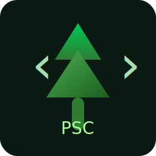

# Pine Script Compiler (v4/v5/v6)

  

    

English | [中文](#中文说明)

A local, incremental Pine Script compiler providing syntax and semantic analysis, aiming to power high-quality tooling and CI for TradingView Pine Script (v4/v5/v6).

**Features**
- Syntax parsing and AST scaffolding
- Early-stage semantic analyzer
- CLI entry with scripts: `dev`, `build`, `type-check`, `test`, `start`
- CI with Node 18.x/20.x, ESLint annotations, TypeScript check and build

**Quick Start**
- `git clone https://github.com/CHANGGELY/pine-script-compiler.git`
- `cd pine-script-compiler`
- `npm install`
- Develop: `npm run dev` (runs `src/cli.ts` with `tsx`)
- Type-check & test: `npm run type-check` and `npm test -- --coverage`
- Build and run CLI: `npm run build` and `npm run start -- --help`

**Roadmap**
- Robust lexer and parser
- Type system and inference
- Full semantic rules and diagnostics
- Cross-version support (v4/v5/v6 specifics)
- Release binaries and docs

**Contributing**
- PRs welcome. Follow ESLint/Prettier rules; CI annotates issues as warnings.
- Use clear commit messages (English or Chinese). For large changes, include a short design note in PR description.

**License**
- MIT

---

## 中文说明

一个本地增量式的 Pine Script 编译器，提供语法解析与语义分析，目标是为 Pine Script（v4/v5/v6）打造高质量的开发工具链与 CI 能力。

**特性**
- 语法解析与 AST 框架
- 语义分析雏形
- CLI 入口与脚本：`dev`、`build`、`type-check`、`test`、`start`
- CI：Node 18.x/20.x，ESLint 注解、TypeScript 检查与构建

**快速开始**
- `git clone https://github.com/CHANGGELY/pine-script-compiler.git`
- `cd pine-script-compiler`
- `npm install`
- 开发调试：`npm run dev`（使用 `tsx` 运行 `src/cli.ts`）
- 类型检查与测试：`npm run type-check` 与 `npm test -- --coverage`
- 构建与运行 CLI：`npm run build` 与 `npm run start -- --help`

**规划路线**
- 强健的词法/语法分析器
- 类型系统与推断
- 完整的语义规则与诊断
- 多版本差异支持（v4/v5/v6）
- 发布二进制与文档

**参与贡献**
- 欢迎 PR。请遵循 ESLint/Prettier 规则；CI 会以注解形式提示问题。
- 提交信息中英文皆可；重大变更请在 PR 描述附简要设计说明。

**许可证**
- MIT
