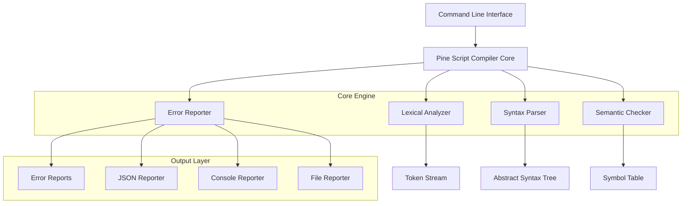
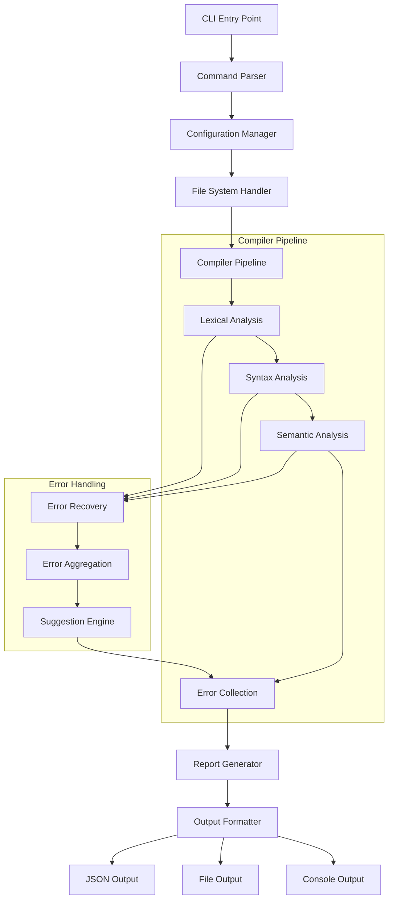
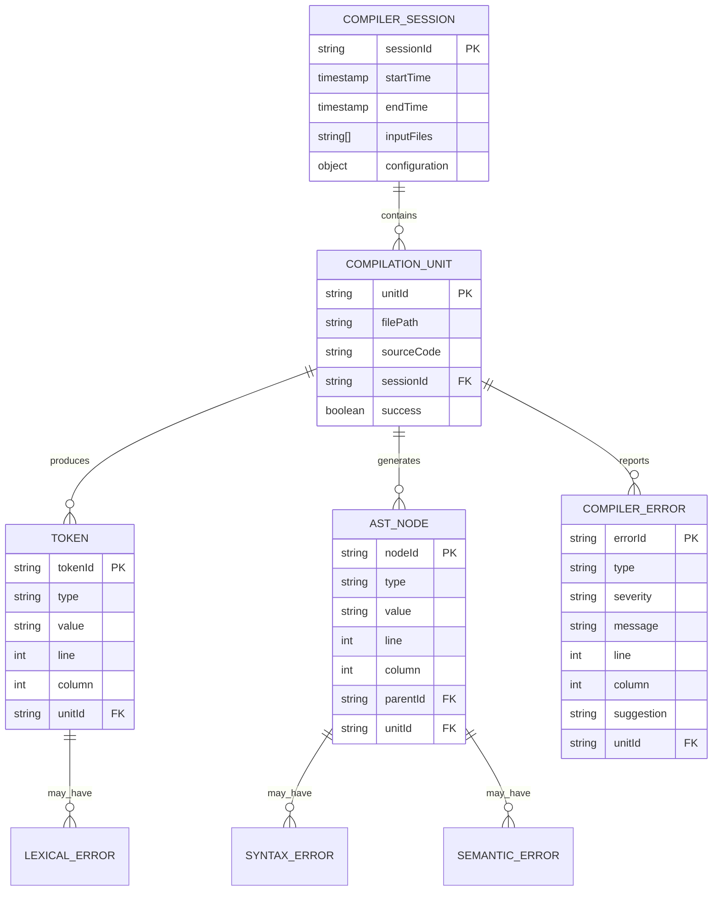

## 1. Architecture design



## 2. Technology Description

* Frontend: Command Line Interface (CLI)
* Backend: Node.js@20 + TypeScript@5 + Commander.js@11
* Parser: Custom recursive descent parser
* Testing: Jest@29 + TypeScript
* Build: esbuild + npm scripts

## 3. Route definitions

| Route                              | Purpose                  |
| ---------------------------------- | ------------------------ |
| pine-compiler [file]              | 编译单个Pine Script文件并输出错误报告 |
| pine-compiler --batch [directory] | 批量编译目录下所有Pine Script文件   |
| pine-compiler --config [file]     | 使用指定配置文件进行编译             |
| pine-compiler --init               | 初始化项目配置文件                |
| pine-compiler --validate [file]   | 仅进行语法验证，不生成完整报告          |
| pine-compiler --help               | 显示帮助信息和使用示例              |

## 4. API definitions

### 4.1 Core API

编译器核心接口

```typescript
interface CompilerOptions {
  strictMode: boolean;
  outputFormat: 'json' | 'table' | 'minimal';
  includeWarnings: boolean;
  maxErrors: number;
}

interface CompileResult {
  success: boolean;
  errors: CompilerError[];
  warnings: CompilerWarning[];
  ast?: ASTNode;
  executionTime: number;
}
```

词法分析接口

```typescript
interface Token {
  type: TokenType;
  value: string;
  line: number;
  column: number;
  position: number;
}

interface LexerResult {
  tokens: Token[];
  errors: LexicalError[];
}
```

语法分析接口

```typescript
interface ASTNode {
  type: NodeType;
  children: ASTNode[];
  value?: any;
  location: SourceLocation;
}

interface ParseResult {
  ast: ASTNode | null;
  errors: SyntaxError[];
}
```

错误报告接口

```typescript
interface CompilerError {
  type: 'lexical' | 'syntax' | 'semantic';
  severity: 'error' | 'warning' | 'info';
  message: string;
  location: SourceLocation;
  suggestion?: string;
  code: string;
}

interface SourceLocation {
  line: number;
  column: number;
  length: number;
  source: string;
}
```

## 5. Server architecture diagram



## 6. Data model

### 6.1 Data model definition



### 6.2 Data Definition Language

配置文件结构 (pine-compiler.config.json)

```json
{
  "version": "1.0.0",
  "rules": {
    "strictSyntax": true,
    "requireDocstrings": false,
    "maxLineLength": 120,
    "allowDeprecatedFunctions": false
  },
  "output": {
    "format": "table",
    "includeWarnings": true,
    "colorOutput": true,
    "maxErrors": 50
  },
  "parser": {
    "version": "v5",
    "strictMode": true,
    "allowExperimentalFeatures": false
  }
}
```

错误代码定义

```typescript
enum ErrorCodes {
  // Lexical Errors (1000-1999)
  INVALID_CHARACTER = 1001,
  UNTERMINATED_STRING = 1002,
  INVALID_NUMBER_FORMAT = 1003,
  
  // Syntax Errors (2000-2999)
  UNEXPECTED_TOKEN = 2001,
  MISSING_SEMICOLON = 2002,
  UNMATCHED_PARENTHESES = 2003,
  INVALID_FUNCTION_DECLARATION = 2004,
  
  // Semantic Errors (3000-3999)
  UNDEFINED_VARIABLE = 3001,
  TYPE_MISMATCH = 3002,
  INVALID_FUNCTION_CALL = 3003,
  PLOT_IN_LOOP = 3004,
  TUPLE_ASSIGNMENT_ERROR = 3005
}
```

Pine Script语法规则定义

```typescript
interface GrammarRule {
  name: string;
  pattern: RegExp | string;
  action: (match: string) => Token;
  precedence?: number;
}

const PINE_GRAMMAR: GrammarRule[] = [
  {
    name: 'STRATEGY_DECLARATION',
    pattern: /^strategy\s*\(/,
    action: (match) => ({ type: 'STRATEGY', value: match })
  },
  {
    name: 'PLOT_CALL',
    pattern: /^plot\s*\(/,
    action: (match) => ({ type: 'PLOT', value: match })
  },
  {
    name: 'VARIABLE_ASSIGNMENT',
    pattern: /^[a-zA-Z_][a-zA-Z0-9_]*\s*:?=/,
    action: (match) => ({ type: 'ASSIGNMENT', value: match })
  }
];
```
