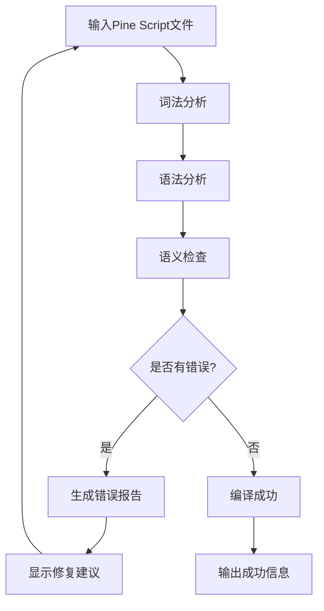

## 1. Product Overview

Pine Script本地编译器是一个专为Pine Script开发者设计的命令行工具，解决了开发者无法在本地验证Pine Script代码语法和语义的痛点。该工具提供完整的代码分析能力，包括词法分析、语法分析、语义检查和详细的错误报告，让开发者能够在提交到TradingView之前就发现并修复代码问题。

目标市场价值：提升Pine Script开发效率，减少调试时间，为量化交易策略开发提供更好的本地开发体验。

## 2. Core Features

### 2.1 User Roles

| Role | Registration Method | Core Permissions |
|------|---------------------|------------------|
| Pine Script Developer | 直接使用命令行工具 | 可编译分析Pine Script文件，查看错误报告 |
| Team Lead | 配置团队规范 | 可设置代码规范检查规则，生成团队报告 |

### 2.2 Feature Module

我们的Pine Script编译器包含以下核心页面：
1. 命令行界面: 文件输入处理、编译选项配置、结果输出展示
2. 错误报告页面: 错误详情展示、修复建议、代码定位
3. 配置管理页面: 编译规则设置、输出格式配置、团队规范管理

### 2.3 Page Details

| Page Name | Module Name | Feature description |
|-----------|-------------|---------------------|
| 命令行界面 | 文件输入处理 | 支持单文件和批量文件编译，自动检测Pine Script文件格式 |
| 命令行界面 | 编译选项配置 | 提供详细度级别、输出格式、规则集选择等配置选项 |
| 命令行界面 | 结果输出展示 | 以结构化格式显示编译结果，支持JSON、表格、彩色文本输出 |
| 错误报告页面 | 错误详情展示 | 显示错误类型、行号、列号、错误描述和上下文代码 |
| 错误报告页面 | 修复建议 | 基于错误类型提供具体的修复建议和示例代码 |
| 错误报告页面 | 代码定位 | 精确定位错误位置，高亮显示问题代码片段 |
| 配置管理页面 | 编译规则设置 | 自定义语法检查规则、语义检查级别、代码风格规范 |
| 配置管理页面 | 输出格式配置 | 设置报告格式、详细程度、颜色主题等显示选项 |
| 配置管理页面 | 团队规范管理 | 导入导出团队编码规范，统一代码质量标准 |

## 3. Core Process

开发者工作流程：
用户通过命令行输入Pine Script文件路径 → 编译器执行词法分析检测基础语法错误 → 进行语法分析构建抽象语法树 → 执行语义检查验证逻辑正确性 → 生成详细错误报告或成功确认 → 用户根据报告修复代码并重新编译

团队管理员流程：
管理员配置团队编码规范 → 设置自动化检查规则 → 团队成员使用统一配置进行编译 → 生成团队代码质量报告

## 4. User Interface Design

### 4.1 Design Style

- 主色调: 深蓝色 (#1e3a8a) 和绿色 (#059669) 用于成功状态
- 辅助色: 红色 (#dc2626) 用于错误，黄色 (#d97706) 用于警告
- 按钮风格: 简洁的命令行风格，支持彩色文本输出
- 字体: 等宽字体 (Consolas, Monaco) 确保代码对齐
- 布局风格: 基于命令行的文本界面，支持表格和树形结构显示
- 图标风格: 使用ASCII字符和Unicode符号，如 ✓ ✗ ⚠ 等

### 4.2 Page Design Overview

| Page Name | Module Name | UI Elements |
|-----------|-------------|-------------|
| 命令行界面 | 文件输入处理 | 文件路径输入提示，拖拽支持，批量文件列表显示 |
| 命令行界面 | 编译选项配置 | 参数选项列表，帮助文档，配置文件加载指示 |
| 命令行界面 | 结果输出展示 | 彩色状态指示器，进度条，结构化错误列表，统计摘要 |
| 错误报告页面 | 错误详情展示 | 错误级别图标，代码行号，语法高亮，错误类型标签 |
| 错误报告页面 | 修复建议 | 建议操作按钮，示例代码块，相关文档链接 |
| 配置管理页面 | 编译规则设置 | 规则开关列表，严格程度滑块，自定义规则编辑器 |

### 4.3 Responsiveness

该产品主要面向命令行环境，支持各种终端尺寸的自适应显示。输出格式会根据终端宽度自动调整，支持窄屏和宽屏显示模式。
